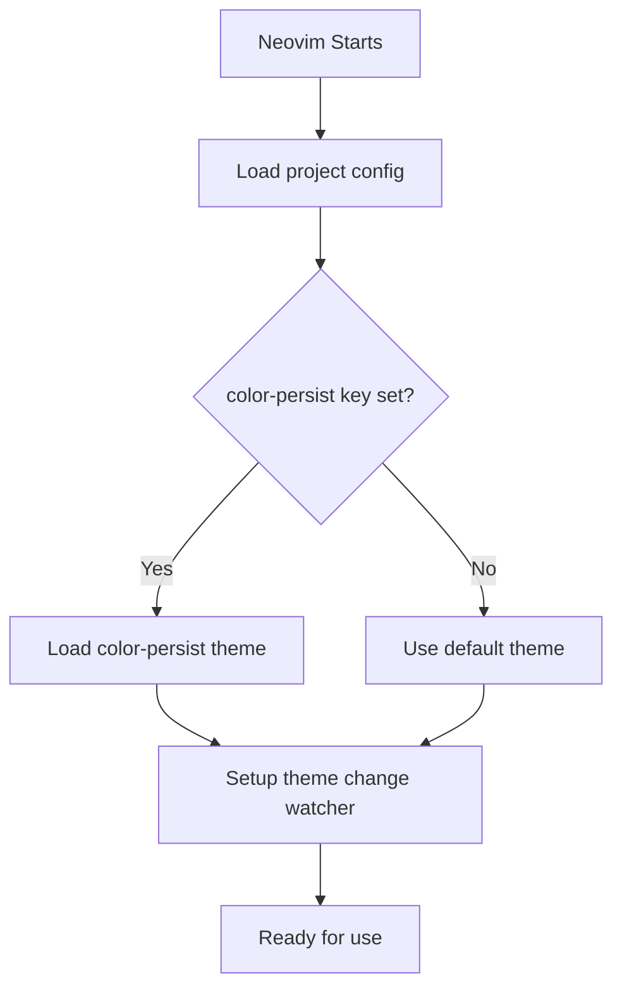
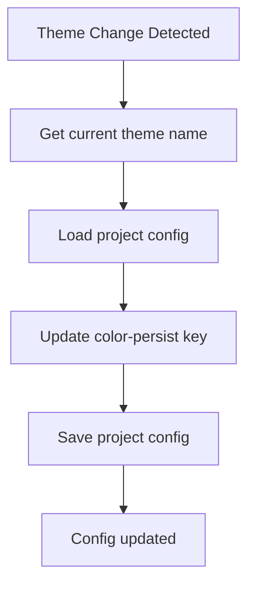

# project-color-nvim

A Neovim plugin that persists your current theme using [nvim-projectconfig](https://github.com/windwp/nvim-projectconfig), allowing you to maintain consistent color schemes across different projects and sessions.

## Features

- Automatically loads theme from project config on startup
- Tracks and persists theme changes using nvim-projectconfig
- Stores theme in `color-persist` key in project JSON
- Works with any Neovim colorscheme

## Installation

Using [lazy.nvim](https://github.com/folke/lazy.nvim):

```lua
{
  'rektide/project-color',
  dependencies = { 'windwp/nvim-projectconfig' },
  config = function()
    require('project-color-nvim').setup()
  end
}
```

Using [packer.nvim](https://github.com/wbthomason/packer.nvim):

```lua
use {
  'rektide/project-color',
  requires = { 'windwp/nvim-projectconfig' },
  config = function()
    require('project-color-nvim').setup()
  end
}
```

## Configuration

```lua
require('project-color-nvim').setup({
  enabled = true,
  autoload = true,
  persist = true,
})
```

**Options:**

| Option   | Type    | Default | Description                                                                      |
|----------|---------|---------|----------------------------------------------------------------------------------|
| `enabled` | boolean | `true`  | Enable/disable plugin. When false, plugin does nothing.                           |
| `autoload`| boolean | `true`  | Automatically load theme from project config on startup. When false, plugin watches changes but doesn't load a theme. |
| `persist` | boolean | `true`  | Persist theme changes to project config. When false, plugin loads theme but doesn't write changes. |

## How It Works

### Load Flow

The plugin checks for theme in project config when Neovim starts:



### Theme Change Flow

When you change your theme, the plugin updates the project config:



## Architecture

The plugin uses [nvim-projectconfig](https://github.com/windwp/nvim-projectconfig) for all configuration persistence:

### Module Structure

```
lua/project-color-nvim/
├── init.lua       - Main plugin entry point and orchestration
├── config.lua     - Plugin configuration management
├── theme.lua      - Theme retrieval and colorscheme loading
└── autocmds.lua   - Autocmd setup and event handling
```

### Module Responsibilities

**config.lua**

- Defines default plugin configuration
- Handles `setup(opts)` - merges user options with defaults
- Provides configuration validation

**theme.lua**

- Retrieves current theme name from Neovim
- Loads a specified colorscheme
- Handles theme loading errors gracefully
- Provides wrapper around `vim.g.colors_name` and `vim.cmd.colorscheme`

**autocmds.lua**

- Sets up `ColorScheme` autocmd listener
- Manages plugin lifecycle events
- Coordinates theme persistence on theme changes using nvim-projectconfig

**init.lua**

- Main entry point for the plugin
- Orchestrates the initialization sequence
- Coordinates loading theme from project config on startup
- Exports public API (`setup()`)
- Connects all modules together

## Usage

1. Ensure you have nvim-projectconfig installed and configured
2. Start Neovim in your project directory
3. The plugin will automatically load the theme stored in the `color-persist` key of your project config
4. When you change your theme with `:colorscheme <name>`, the plugin updates the `color-persist` key in your project config

For detailed technical specification of how project-color-nvim integrates with nvim-projectconfig, see [doc/projectconfig.md](doc/projectconfig.md).

## License

MIT
