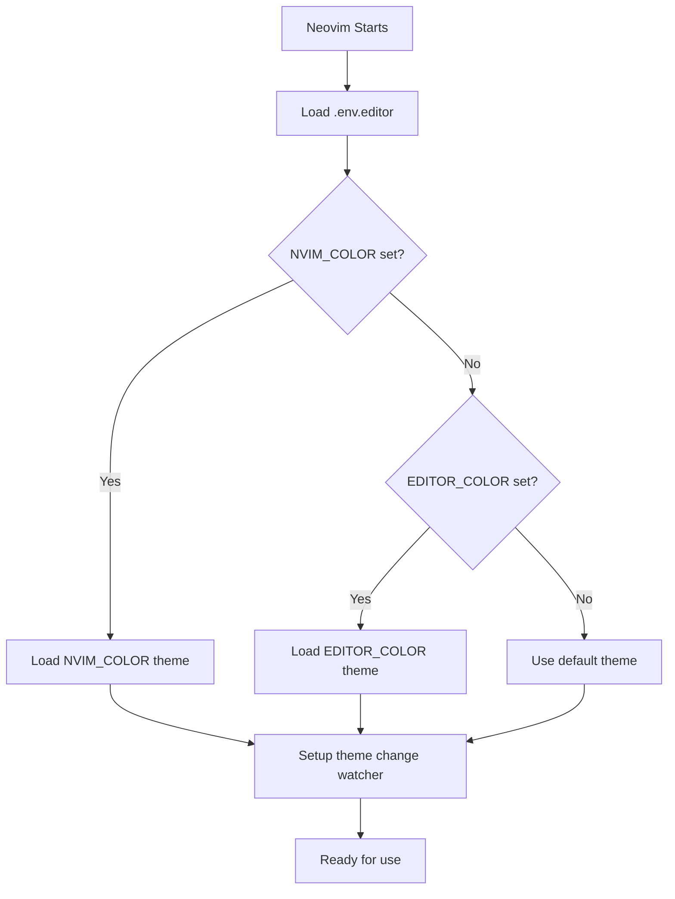
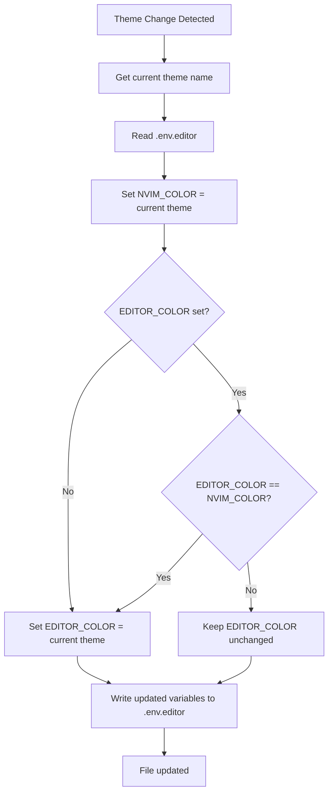

# nvim-color-persist

A Neovim plugin that persists your current theme to a `.env.editor` file, allowing you to maintain consistent color schemes across different projects and sessions.

## Features

- Automatically loads theme from `.env.editor` on startup
- Tracks and persists theme changes
- Supports both `NVIM_COLOR` (primary) and `EDITOR_COLOR` (fallback) variables
- Works with any Neovim colorscheme

## Installation

Using [lazy.nvim](https://github.com/folke/lazy.nvim):

```lua
{
  'rektide/nvim-color-persist',
  config = function()
    require('nvim-color-persist').setup()
  end
}
```

Using [packer.nvim](https://github.com/wbthomason/packer.nvim):

```lua
use {
  'rektide/nvim-color-persist',
  config = function()
    require('nvim-color-persist').setup()
  end
}
```

## Configuration

```lua
require('nvim-color-persist').setup({
  env_file = '.env.editor',
})
```

## How It Works

### Load Flow

The plugin checks for a `.env.editor` file when Neovim starts:



### Theme Change Flow

When you change your theme, the plugin updates the `.env.editor` file:



## Architecture

The plugin is organized into feature-based modules for clear separation of concerns:

### Module Structure

```
lua/nvim-color-persist/
├── init.lua       - Main plugin entry point and orchestration
├── config.lua     - Configuration management and defaults
├── env.lua        - Env file parsing and writing operations
├── theme.lua      - Theme retrieval and colorscheme loading
└── autocmds.lua   - Autocmd setup and event handling
```

### Module Responsibilities

**config.lua**
- Defines default plugin configuration (`env_file`, `augroup`, etc.)
- Handles `setup(opts)` - merges user options with defaults
- Provides configuration validation
- Exports getter functions for config values
- Manages configuration constants

**env.lua**
- Parses dotenv-format files (KEY=value)
- Writes updated variables to env files
- Handles file I/O operations for `.env.editor`
- Manages key constants (`NVIM_COLOR`, `EDITOR_COLOR`)
- Provides pure functions for parsing and impure functions for writing

**theme.lua**
- Retrieves current theme name from Neovim
- Loads a specified colorscheme
- Handles theme loading errors gracefully
- Provides wrapper around `vim.g.colors_name` and `vim.cmd.colorscheme`

**autocmds.lua**
- Sets up the `ColorScheme` autocmd listener
- Creates the plugin's augroup
- Manages plugin lifecycle events
- Coordinates theme persistence on theme changes

**init.lua**
- Main entry point for the plugin
- Orchestrates the initialization sequence
- Coordinates loading theme from env file on startup
- Exports public API (`setup()`)
- Connects all modules together

### Module Interactions

- **init.lua** uses **config.lua** to get configuration
- **init.lua** uses **env.lua** to parse the env file and load initial theme
- **init.lua** uses **theme.lua** to apply the loaded theme
- **init.lua** uses **autocmds.lua** to set up change watching
- **autocmds.lua** uses **theme.lua** to get current theme on changes
- **autocmds.lua** uses **env.lua** to read and write the env file
- All modules use **config.lua** for configuration values

## Environment Variables

The plugin looks for these variables in your `.env.editor` file:

- `NVIM_COLOR` - Primary theme variable (takes precedence)
- `EDITOR_COLOR` - Fallback theme variable

Example `.env.editor` file:

```env
NVIM_COLOR=tokyonight
EDITOR_COLOR=tokyonight
```

## Usage

1. Create a `.env.editor` file in your project root
2. Set your preferred theme using either `NVIM_COLOR` or `EDITOR_COLOR`
3. Start Neovim in the project directory
4. The plugin will automatically load the specified theme
5. When you change your theme with `:colorscheme <name>`, the plugin updates the `.env.editor` file

## License

MIT
